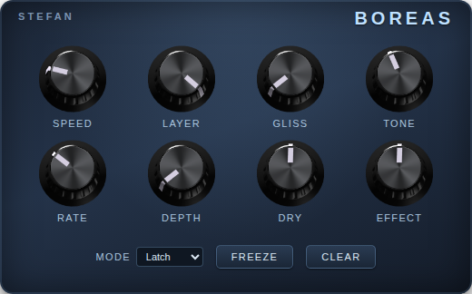

# Boreas



**Freeze / infinite-sustain pedal for [MOD Desktop](https://mod.audio/desktop/),
[MOD Dwarf](https://mod.audio/dwarf/), and any VST3 / CLAP / LV2 host.** Capture a
moment of sound and hold it as a smooth, endless drone — stack layers, slide them in
by pitch, shape the tone, and add organic movement. Built with the
[DISTRHO Plugin Framework (DPF)](https://github.com/DISTRHO/DPF) as a mono-in /
mono-out plugin in **LV2, VST3, and CLAP** formats.

Boreas freezes by **spectral resynthesis**, not looping: it analyses the captured sound
into a bank of steady sine oscillators and plays *those*, so the sustain is dead steady
with no loop seam, no choppiness, and no buzz.

---

## Platforms & formats

One DSP, built once and shipped everywhere — grab a prebuilt build from the
[**Releases page**](../../releases), or build from source (below):

| Where it runs | Format | Get it |
|---|---|---|
| **MOD Desktop** (Linux x86-64) | LV2 + modgui | `…-linux-amd64.tar.gz`, or `./install.sh` |
| **MOD Dwarf** | LV2 (aarch64) | `…-dwarf-aarch64.tar.gz`, or `make dwarf` |
| **Raspberry Pi 4** (64-bit) | LV2 | `…-rpi-aarch64.tar.gz` |
| **Patchbox OS** (32-bit Pi) | LV2 | `…-patchbox-os-arm32.tar.gz` |
| **Desktop DAWs** — Linux, Windows, macOS | **VST3 + CLAP** | per-OS bundles (macOS: unsigned `.pkg`) |
| **Any LV2 host** (Ardour, Carla, Reaper, …) | LV2 | the Linux LV2 bundle above |

Also published on [**Patchstorage**](https://patchstorage.com/). The desktop VST3/CLAP
binaries for every OS are built by GitHub Actions and attached to each release; the MOD
Dwarf and Patchstorage bundles are built locally (they need their own toolchains).

---

## Controls

**Three footswitches** and a row of knobs:

| Footswitch | What it does |
|---|---|
| **Freeze** | Capture the current sound and sustain it. Each press **stacks another layer** (up to six). |
| **Hold** | **Momentary** freeze — sustains *only while held*, and thaws on release. Good for quick swells without leaving a layer behind. |
| **Clear** | Each press **removes the most-recent layer**. |

| Knob | What it does |
|---|---|
| **Speed** | Per-layer **volume** fade in/out time — from ~5 ms (instant) to ~4 s (slow swell). |
| **Layer** | Level each newly-stacked layer comes in at. |
| **Gliss** | **Pitch** slide-in (portamento): a new layer starts below pitch and glides up. 0 = no slide; max ≈ one octave over ~2 s. |
| **Tone** | Output high-cut. ~500 Hz (dark) → ~18 kHz (open); the default (~2 kHz) tames frozen high-frequency hiss. |
| **Move Rate** / **Move Depth** | **Movement** LFO — organic amplitude breathing + a subtle pitch shimmer. Rate ≈ 0.05–8 Hz. **Depth = 0 is off** (the freeze is then perfectly static). |
| **Dry** / **Effect** | Output mix of the dry input and the frozen signal. |

Up to **six layers** can be stacked; the total number of live partials across all layers
is capped (~96) so CPU stays bounded on the Dwarf no matter how many you stack.

*All three footswitches are momentary: **Freeze** and **Clear** fire once per press
(triggers), while **Hold** stays active only while pressed. The LV2 port-property
details are in [`INSTRUCTIONS.md`](INSTRUCTIONS.md).*

---

## How it works (DSP)

```
input ──► ring buffer (1 s) ──────────────────────────────► dry ──┐
                │  (Freeze press)                                  │
                ▼                                                  ▼
        capture 150 ms window                                  Dry × in
                │                                                  +
                ▼                                            Effect × wet ──► out
        ┌───────────────────────────────────────┐                ▲
        │ per layer (×6):                        │                │
        │   FFT → spectral peaks → oscillator    │── Σ ─► Tone ─► tanh
        │   bank  +  Movement  +  Gliss  +  fade  │   (high-cut)  (soft-limit)
        └───────────────────────────────────────┘
```

### 1. Continuous capture
The input is always written into a 1-second **ring buffer**. When you press **Freeze**,
the most-recent **150 ms** window is copied out and frozen — nothing is recorded ahead of
time, so the capture is "what you just played." (Only that 150 ms is used today; the rest
of the ring is reserved headroom for a future **Lookback** control — capturing a window
from *before* the stomp — which the capture path already supports. *TODO.*)

### 2. Spectral resynthesis (the core)
Each frozen layer is built by a **sinusoidal model** (`SinusoidalModel.hpp`):

1. The 150 ms window is **Hann-windowed** and run through an **8192-point FFT**.
2. **Spectral peaks** are picked (local maxima above −60 dB) and refined to sub-bin
   accuracy by **parabolic interpolation**, giving each partial a precise
   *frequency, amplitude, and phase*. Up to ~96 partials are kept.
3. A **minimum 60 Hz separation** is enforced between kept partials. This is the key to
   the smooth sound: a real recording smears each harmonic into a little cluster of
   neighbouring FFT peaks, and if you resynthesise those as steady tones they **beat**
   against each other — an amplitude flutter that sounds choppy/buzzy. Keeping only the
   strongest peak per ~60 Hz band removes the beating while preserving the timbre.
4. Playback is a **bank of steady sine oscillators** (one per partial, via a sine LUT
   driven by a fixed-point phase accumulator — cheap on the Dwarf's in-order CPU).
   There is no loop and no time-domain playback, so the sustain never repeats, drifts,
   or seams — it just holds.

The FFT runs only once, at capture; the per-sample cost is the oscillator bank.

### 3. Layer stack
Up to **six** layers play summed (`FreezeEngine.hpp`). Each **Freeze** press captures and
pushes a new layer; **Clear** removes the most-recent one; **Hold** is a momentary
footswitch that sustains a freeze only while it's held. The total live oscillator count
across all layers is capped (~96) so steady-state CPU stays bounded on the Dwarf. Each
layer has its own gain envelope:

- **Speed** sets the fade-in (on add) and fade-out (on remove/clear) time.
- **Gliss** gives a new layer a one-shot **pitch glide**: its oscillator frequencies
  start a fraction below pitch and ramp up (a portamento swoop). 0 = arrive at pitch.
- **Layer** scales the level a new layer enters at.

### 4. Movement (per layer)
`Modulator.hpp` adds life so the freeze isn't sterile. Each layer gets its own modulator:

- **Amplitude breathing** — the sum of two incommensurate parabolic-sine LFOs, so it
  drifts organically rather than ticking like a metronome (up to ±60 % at full depth).
- **Pitch shimmer** — a third, slower LFO detunes the partials by at most ≈ ±10 cents.
- Each layer seeds its own phases and a small (±6 %) rate offset, so **stacked layers
  shimmer independently**.
- **Depth = 0 returns exactly unity** — a true bypass, so with Movement off the freeze is
  bit-identical to the static resynthesis.

### 5. Tone, mix, and safety
The summed layers pass through a one-pole **high-cut** (`ToneFilter.hpp`), then a `tanh`
**soft-limiter** so stacking many layers can't hard-clip. The wet signal is mixed with the
dry input (**Dry**/**Effect**), and **flush-to-zero** is enabled on the audio thread so
decaying denormal floats can't cause CPU spikes / xruns at small buffer sizes.

---

## Compared to a spectral (phase-vocoder) freeze

A common way to build a freeze — e.g. [MrFreeze](https://github.com/romi1502/MrFreeze) — is
a **phase-vocoder spectral freeze**: capture one FFT frame's *full* magnitude spectrum, then
resynthesise by repeatedly **inverse-FFTing it with overlap-add**, advancing each bin's phase
per hop so successive frames stay coherent. Boreas takes the **sinusoidal-model** route
instead — it keeps only the spectral *peaks* as discrete partials and plays them on an
oscillator bank. Same starting point (FFT-analyse one moment), opposite philosophies:

| | Phase-vocoder freeze (e.g. MrFreeze) | Boreas (sinusoidal model) |
|---|---|---|
| What's frozen | the **full** magnitude spectrum (every bin) | ~96 **discrete peaks** |
| Partial frequency | quantised to the FFT **bin grid** | **sub-bin** (parabolic interpolation) |
| Resynthesis | inverse-FFT + overlap-add, **every hop** | **oscillator bank**, per sample |
| Steady-state CPU | an IFFT per hop, continuously | cheap oscillators (FFT runs once, at capture) |
| Smeared / close partials | kept (all bins) | **merged** (≥ 60 Hz apart) |

The practical upshot: the spectral approach reproduces the timbre *literally* (noise and all)
but carries the phase-vocoder's faint "glassy/watery" shimmer and an ongoing FFT cost. Boreas
distils the sound to its strongest partials at their true frequencies — losing some fine
texture, but giving a dead-steady, beating-free tone for almost no steady-state cost. The
≥ 60 Hz peak-merging is the deliberate fix for the inter-partial beating a full-spectrum
freeze leaves in.

---

## Code architecture

The DSP is header-only and framework-independent, so it can be unit-tested natively
without DPF or a host:

| File | Responsibility |
|---|---|
| `dsp/Constants.hpp` | Sample-rate-aware mappings (window length, speed/gliss/move-rate curves). |
| `dsp/CircularBuffer.hpp` | The input ring buffer + windowed capture. |
| `dsp/FFT.hpp` | Radix-2 iterative FFT. |
| `dsp/SinusoidalModel.hpp` | FFT peak analysis + steady oscillator-bank synthesis. |
| `dsp/Modulator.hpp` | Per-layer Movement LFO (breathing + shimmer). |
| `dsp/ToneFilter.hpp` | One-pole output high-cut. |
| `dsp/FreezeEngine.hpp` | Orchestrates capture, the layer stack, fades, gliss, movement, tone. |
| `BoreasPlugin.cpp` | DPF plugin: parameters, footswitch edge/hold logic, dry/wet mix. |
| `modgui/` | The MOD pedalboard GUI (HTML/CSS/JS + knob sprite). |

### Tests
A dependency-free `g++` harness lives in `tests/` (one `test_*.cpp` per component):

```bash
make -C tests test     # build and run all DSP unit tests
```

---

## Building & installing

```bash
git clone --recurse-submodules <repo-url> boreas
cd boreas
make                               # build bin/boreas.{lv2,vst3,clap} (host toolchain)
MOD_DESKTOP_PLUGINS=/path/to/mod-desktop/plugins ./install.sh
```

Then restart MOD Desktop so it rescans plugins; Boreas appears under brand **Stefan**.

| Command | What it does |
|---|---|
| `make` | Build `bin/boreas.{lv2,vst3,clap}` with the host toolchain |
| `make beta` | Build the side-by-side `boreas-beta.lv2` variant (distinct URI/id) |
| `./install.sh` | Install into MOD Desktop's user-plugin dir |
| `make -C tests test` | Run the DSP unit tests |
| `make dwarf` | Cross-compile (Docker) + deploy to a connected MOD Dwarf |
| `make release version=x.y.z` | Build, package, tag, push, and create a GitHub release |
| `make clean` | Delete `bin/`, `build/` |

The identity (name/brand/URI) lives in the top-level [`Makefile`](Makefile) and
[`DistrhoPluginInfo.h`](plugins/Boreas/DistrhoPluginInfo.h).

### Publishing to Patchstorage
Boreas can also be published to [patchstorage.com](https://patchstorage.com)'s LV2-plugins
platform (`linux-amd64`, `rpi-aarch64`, and `patchbox-os-arm32` targets):

- `make patchstorage-build` — cross-build all three bundles
- `make patchstorage-prepare` — assemble + inspect the upload payload before publishing
- `make patchstorage PS_USER=<username>` — build, prepare, and push (password prompted
  interactively)

See [`patchstorage-build/README.md`](patchstorage-build/README.md) for prerequisites and details.

### modgui notes
The pedal GUI is a custom MOD modgui. A couple of MOD-specific gotchas are documented in
[`INSTRUCTIONS.md`](INSTRUCTIONS.md): the scanner requires a `screenshot`/`thumbnail` (it
segfaults otherwise), and custom knobs need a film-sprite shipped under `modgui/knobs/`.
The `screenshot-boreas.png` / `thumbnail-boreas.png` are rendered from the icon/stylesheet
via headless Chrome — re-render them if the UI changes.

---

## Acknowledgements
- [DISTRHO Plugin Framework (DPF)](https://github.com/DISTRHO/DPF) — the LV2/VST/CLAP framework.
- [MOD Audio](https://mod.audio) — the Dwarf, MOD Desktop, mod-plugin-builder, and the modgui design.
- Inspired by the EHX Deep Freeze and the family of freeze / infinite-sustain pedals.

## License
Plugin code is ISC-licensed. DPF is ISC-licensed (see [`dpf/LICENSE`](dpf/LICENSE)).
